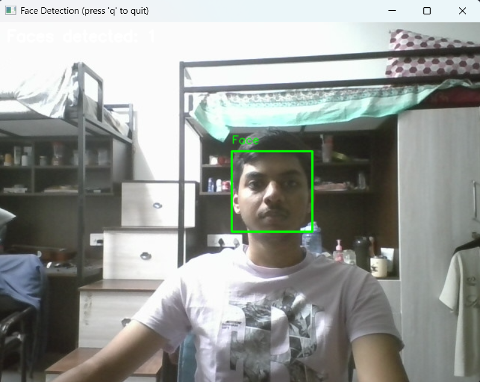

# Face Detection CLI using OpenCV

A modular command-line computer vision application for detecting human faces in **images, videos, and live webcam feeds** using OpenCV.

The project supports two detection approaches:

- **Haar Cascade** — classical computer-vision face detector
- **DNN/SSD** — deep-learning based detector

## Sample Output

The application successfully detects a face from a live webcam feed and draws a bounding box around the detected face.



## Features

- Detect faces in images
- Detect faces in video files
- Real-time webcam face detection
- Haar Cascade and DNN detection backends
- Configurable webcam device index
- Frame-skipping for video/webcam processing
- Automatic annotated output generation
- Centralized logging
- Unit tests
- Project documentation and diagrams

## Tech Stack

- Python 3.11+
- OpenCV
- NumPy
- PyTest

## Project Structure

```text
face-detection-opencv/
├── main.py
├── config.py
├── modules/
│   ├── face_detector.py
│   ├── image_processor.py
│   ├── video_processor.py
│   ├── logger_config.py
│   └── utils.py
├── tests/
├── models/
│   └── README.md
├── docs/
│   ├── Project_Report.pdf
│   ├── architecture_diagram.png
│   ├── class_diagram.png
│   ├── sequence_diagram.png
│   ├── use_case_diagram.png
│   ├── workflow_diagram.png
│   └── sample_output.png
├── requirements.txt
├── statement.md
├── .gitignore
└── README.md
```

## Installation

### 1. Clone the repository

```bash
git clone https://github.com/neel-singh/face-detection-opencv.git
cd face-detection-opencv
```

### 2. Create a virtual environment

**Windows PowerShell:**

```powershell
py -3.11 -m venv venv
.\venv\Scripts\Activate.ps1
```

**macOS/Linux:**

```bash
python3 -m venv venv
source venv/bin/activate
```

### 3. Install dependencies

```bash
python -m pip install --upgrade pip
pip install -r requirements.txt
```

## Usage

### Webcam

```bash
python main.py --mode webcam --show --method haar
```

Press **Q** to close the preview.

### Image

```bash
python main.py --mode image --input path/to/photo.jpg --method haar
```

### Video

```bash
python main.py --mode video --input path/to/video.mp4 --method haar
```

### DNN detector

After downloading the required model files, run:

```bash
python main.py --mode webcam --show --method dnn
```

See [`models/README.md`](models/README.md) for DNN model setup.

### Command-line help

```bash
python main.py --help
```

## Testing

Run:

```bash
pytest tests/ -v
```

## Architecture

```text
Input
  │
  ├── Image
  ├── Video
  └── Webcam
       │
       ▼
Image / Video Processor
       │
       ▼
Face Detector
  ├── Haar Cascade
  └── DNN / SSD
       │
       ▼
Detection Results
       │
       ├── Bounding Boxes
       ├── Annotated Output
       └── Logs
```

Detailed diagrams and the project report are available in the [`docs/`](docs/) directory.

## DNN Models

DNN model weights are intentionally excluded from GitHub because they are large binary files. Follow [`models/README.md`](models/README.md) to download and place the required files locally.

## Author

**Neel Singh**

Computer Science Undergraduate  
Computer Vision Course Project