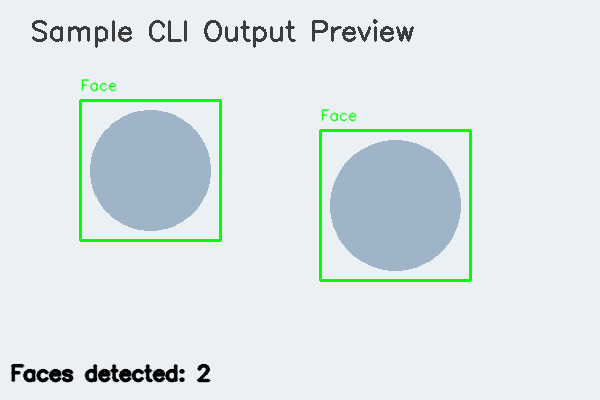

# Face Detection CLI (OpenCV)

A command-line face detection tool built with OpenCV. It can detect
faces in a **still image**, a **video file**, or a **live webcam
feed**, using either the classical **Haar Cascade** detector or a
more accurate **deep-learning (DNN) SSD** detector, and saves an
annotated copy of the input with bounding boxes drawn around every
detected face.

Built as a course project for **Computer Vision**.



---

## 1. Features

- **Image mode** – detect faces in a single JPG/PNG file.
- **Video mode** – detect faces frame-by-frame in a video file and
  save an annotated copy.
- **Webcam mode** – run detection live on a webcam feed.
- **Two selectable detection backends**: Haar Cascade (fast, no
  download needed) and DNN/SSD (more accurate, optional model
  download).
- **Frame-skip control** for smoother performance on slower machines.
- **Centralized logging** to both console and a log file.
- **Modular, class-based architecture** that is easy to extend with
  new detectors or input sources.

## 2. Project Structure

```
face-detection-cv/
├── main.py                     # CLI entry point
├── config.py                   # Central configuration (paths, thresholds)
├── modules/
│   ├── face_detector.py        # Face Detection module (Haar + DNN)
│   ├── image_processor.py      # Image I/O + processing module
│   ├── video_processor.py      # Video/webcam I/O + processing module
│   ├── logger_config.py        # Centralized logging setup
│   └── utils.py                # Drawing / formatting helpers
├── tests/
│   ├── test_face_detector.py   # Unit tests for detection logic
│   └── test_image_processor.py # Unit tests for image pipeline
├── models/                     # (Optional) DNN model files go here
│   └── README.md               # How to download the DNN model files
├── docs/                       # Design diagrams (architecture, UML, etc.)
├── output/                     # Annotated results are written here
├── logs/                       # Run logs
├── requirements.txt
├── statement.md                # Problem statement & scope
└── README.md                   # You are here
```

This gives the project **3 major functional modules**
(`face_detector`, `image_processor`, `video_processor`), each with a
clear, single responsibility, tied together by the `main.py` CLI.

## 3. Requirements

- Python 3.9 or newer
- pip

Dependencies are listed in `requirements.txt`:

```
opencv-python>=4.8.0
numpy>=1.24.0
pytest>=7.4.0
```

## 4. Setup

Clone the repository and install dependencies (a virtual environment
is recommended):

```bash
git clone https://github.com/<your-username>/<your-repo-name>.git
cd <your-repo-name>

python3 -m venv venv
source venv/bin/activate        # Windows: venv\Scripts\activate

pip install -r requirements.txt
```

### Optional: enabling the DNN detector

The Haar Cascade backend (`--method haar`) works immediately with no
extra setup — the cascade file ships inside `opencv-python`. To also
use `--method dnn`, download two small model files as described in
[`models/README.md`](models/README.md) and place them in the
`models/` folder.

## 5. How to Run

All commands are run from the project's root folder.

**Detect faces in an image:**
```bash
python main.py --mode image --input path/to/photo.jpg --method haar
```

**Detect faces in a video file:**
```bash
python main.py --mode video --input path/to/clip.mp4 --method dnn
```

**Detect faces using your webcam, with a live preview window:**
```bash
python main.py --mode webcam --show
```

**Run detection on the webcam headlessly for a fixed number of
frames** (useful on machines/servers without a display):
```bash
python main.py --mode webcam --max-frames 100
```

**Full option list:**
```bash
python main.py --help
```

| Flag | Description | Default |
|---|---|---|
| `--mode` | `image`, `video`, or `webcam` (required) | – |
| `--input` | Path to input image/video (required for `image`/`video`) | – |
| `--output` | Path to save annotated output | auto-generated in `output/` |
| `--method` | `haar` or `dnn` | `haar` |
| `--camera-index` | Webcam device index | `0` |
| `--frame-skip` | Run detector every N frames (video/webcam) | `1` |
| `--max-frames` | Stop after N frames | unlimited |
| `--show` | Show a live preview window | off |

Results are saved under `output/`, and every run is logged to
`logs/face_detection.log`.

## 6. Testing

Unit tests cover the detector and image-processing logic (invalid
input handling, successful detection pipeline, factory validation):

```bash
pip install pytest   # already in requirements.txt
pytest tests/ -v
```

The tests use only synthetically generated images, so they run
without needing any external dataset or model download.

## 7. Non-Functional Requirements Addressed

| Requirement | How it's addressed |
|---|---|
| **Performance** | `--frame-skip` lets the detector run every N frames instead of every frame on video/webcam input. |
| **Usability** | Simple, self-documenting CLI (`--help`) with sensible defaults. |
| **Reliability** | Input files, cascade paths, and model files are validated; the app fails with a clear message instead of crashing silently. |
| **Maintainability** | Modular package layout, a common `FaceDetector` interface, and a single `config.py` for all tunables. |
| **Error Handling** | Custom, specific exceptions (`FileNotFoundError`, `ValueError`, `IOError`) are caught at the CLI boundary and reported to the user. |
| **Logging/Monitoring** | Every run logs to both console and `logs/face_detection.log` via a shared logger. |

## 8. Design Diagrams

See the `docs/` folder for the System Architecture Diagram, Workflow
Diagram, Use Case Diagram, Class Diagram, and Sequence Diagram
generated for this project (also included in the project report).

## 9. Author / Course

Submitted as the flipped-course evaluation project for **Computer
Vision**.
